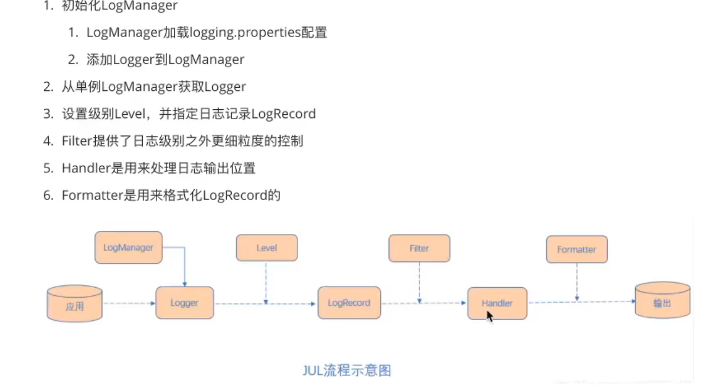

[TOC]

------


## 日志技术简介

1. 日志文件适用于记录系统操作时间的文件集合
2. 大致可以分为两类
   1. 调试日志
      1. 软件开发中，我们经常需要去调试程序，做一些信息，状态的输出便于我们查询程序的运行状况。为了让我们能够更加灵活和方便的控制这些调试的信息，所以我们需要专业的日志技术
      2. java中寻找bug会需要重现，调试就是debug可以在程序运行中暂停程序运行，可以查看程序在运行中的情况。日志主要是为了更方便重现问题
   2. 系统日志
      1. 系统日志记录系统中硬件、软件和系统问题的信息，同时还可以监视系统中发生的事件。用户可以通过它来检查锁雾发生的原因，或者寻找收到攻击时攻击者留下的痕迹

## 曾经的JAVA日志框架

1. 日志的门面JCL、slf4j
2. 日志实现JUL，logback、log4j、log4j2

### JUC入门

1. 架构简介

   1. loggers 日志记录器
   2. Appenders Handlers
   3. Layouts Formatters 对日志事件中的数据进行转化和格式化
   4. Level 每条日志消息都关联一个日志级别
   5. Filters 过滤器

2. 使用

   1. logger.info 输出日志信息
   2. logger.log
      1. 双参数 日志级别，相关信息
      2. 三参数 日志级别，相关信息（占位符），数组（占位符中的信息）

3. 日志级别

   1. SEVERE 严重的 最高级别
   2. WARNING 警告
   3. CONFIG 配置
   4. debug信息
      1. FINE
      2. FINER
      3. FINEST
   5. ALL 日志开关
   6. OFF 关闭
   7. JVM默认的日志级别是info

4. 自定义日志级别

   ```java
   @Test
   public void testLogger() throws IOException {
       // 自定义日志级别
       Logger logger=Logger.getLogger("DesignTest");
       // 关闭系统默认配置
       logger.setUseParentHandlers(false);
       // 创建 ConsoleHandler
       ConsoleHandler consoleHandler=new ConsoleHandler();
       // 创建简单格式转换对象
       SimpleFormatter simpleFormatter=new SimpleFormatter();
       // 进行关联
       consoleHandler.setFormatter(simpleFormatter);
       logger.addHandler(consoleHandler);
       // 配置日志具体级别
       logger.setLevel(Level.ALL);
       consoleHandler.setLevel(Level.ALL);
       // 文件输出
       FileHandler fileHandler = new FileHandler("jul.log");
       fileHandler.setFormatter(simpleFormatter);
       logger.addHandler(fileHandler);
       logger.log(Level.INFO,"Hello world!");
   }
   ```

5. 加载自定义配置文件和配置文件的详解略

6. JUL的工作原理

   

### LOG4J日志框架

1. 日志级别

   ```java
   @Test
   public void testLogger1(){
       // 初始化配置信息
       BasicConfigurator.configure();
       // 获取日志记录器对象
       Logger logger=Logger.getLogger(DesignTest.class);
       logger.fatal("fatal");
       logger.error("error");
       logger.warn("warn");
       logger.info("info");
       logger.debug("debug");
       logger.trace("trace");
   }
   ```

2. 三大组件

   1. Loggers 日志记录器 控制日志的输出级别与日志是否输出
   2. Appenders 输出端 指定日志的输出方式
   3. Layout 日志格式化器 控制日志信息的输出格式

3. Loggers

   1. 最早叫 Category 类
      1. Priority.DEBUG
      2. FileApp ender object
   2. Category object
      1. name="com.foo.Bar"
      2. parent
      3. 继承1

4. Appenders

   1. Appender 用来指定日志输出到哪个地方，可以同时制定日志的输出目的地

      |        输出端类型        |                             作用                             |
      | :----------------------: | :----------------------------------------------------------: |
      |     ConsoleAppender      |                      将日志输出到控制台                      |
      |       FileAppender       |                      将日志输出到文件中                      |
      | DailyRollingFileAppender |     将日志输出到一个日志文件，并且每天输出到一个新的文件     |
      |   RollingFileAppender    | 将日志信息输出到一个日志文件，并且制定文件的尺寸，当文件大小达到制定尺寸时，会自动把文件改名，同时产生一个新的文件 |
      |       JDBCAppender       |                   把日志信息保存到数据库中                   |

5. Layouts

   1. 布局器Layouts用于控制日志输出内容的格式，让我们可以使用各种需要的格式输出日志，Log4j常用Layouts

      | 格式化器类型  |                             作用                             |
      | :-----------: | :----------------------------------------------------------: |
      |  HTMLLayout   |                 格式化日志输出位HTML表格形式                 |
      | SimpleLayout  |    简单的日志输出格式化，打印的日志格式为（info-message）    |
      | PatternLayout | 最强大的格式化器，可以根据自定义格式输出日志，如果没有指定转换格式，就是用默认的转换格式 |

6. ​        LogLog.setInternalDebugging(true); 开启log4j内置的log

7. 配置文件

   1. 向控制台输出

      1. log4j.rootLogger = trace,console 指定RootLogger 顶级父元素默认配置信息
         1. trace 日志级别
         2. console appender的名字
      2. log4j.appender.console = org.apache.log4j.ConsoleAppender 指定appender类型为控制台输出
      3. log4j.appender.console.layout = org.apache.log4j.SimpleLayout 指定消息格式
      4. PatternLayout
         1. log4j.appender.console.layout.conversionPattern 配置
         2. %n - 换行 
         3. %m - 日志内容
         4. %p - 日志级别(FATAL,   ERROR,   WARN,   INFO,   DEBUG   or   custom)
         5. %r - 程序启动到现在的毫秒数
         6. %% - 输出一个%
         7. %t - 当前线程名
         8. %d   -  日期和时间, 常用的格式有 %d{DATE}, %d{ABSOLUTE}, %d{HH:mm:ss,SSS}, %d{ddMMyyyy HH:mm:ss,SSS}。。。
         9. %l - 同 %F%L%C%M
         10. %F - java源文件名
         11. %L - java源码行数
         12. %C - java类名,%C{1} 输出最后一个元素
         13. %M-java方法名

   2. 向文件输出

      ```properties
      log4j.rootLogger = trace,file
      log4j.appender.file = org.apache.log4j.FileAppender
      log4j.appender.file.layout = org.apache.log4j.PatternLayout
      log4j.appender.file.layout.conversionPattern = %d{DATE} %r [%t] %p %c %x - %m%n
      log4j.appender.file.file = log4j.log
      log4j.appender.file.encoding = UTF-8
      ```

   3. RollingFileAppender

      ```properties
      log4j.appender.file.maxFileSize = 1MB
      log4j.appender.file.maxBackup = 10
      ```

   4. DailyRollingFileAppender

      1. 时间规则默认值datePattern 天
      2. 可以更改为其他

   5. JDBCAppender

      

8. 自定义日志

   1. log4j.logger.com.designModel = info,file 默认继承rootLogger
   2. Logger.class 获得的logger是根logger

9. 依赖

   ```xml
           <dependency>
               <groupId>log4j</groupId>
               <artifactId>log4j</artifactId>
               <version>1.2.17</version>
           </dependency>
   ```

   

### JCL

1. 简介

   1. 全称为Jakarta ommons Logging 是Apache提供的一个通用日志API
   2. 他是为“所有的java日志实现”提供一个统一的接口，它自身也提供一个日志的实现，但功能非常弱SimpleLog，
   3. 他允许开发人员使用不同的日志实现工具
   4. JCL有两个基本的抽象类：Log（基本记录器）和LogFactory（负责创建Log实例）

2. JCL原理

3. 遍历日志系统找到需要的日志并使用

4. 已经在2014年被淘汰

5. 依赖

   ```xml
           <dependency>
               <groupId>commons-logging</groupId>
               <artifactId>commons-logging</artifactId>
               <version>1.2</version>
           </dependency>
   ```


## 现在的日志技术

### SLF4J

1. 简介

   1. 简单日志门面（Simple Logging Facade For Java）
   2. 主要意义是实现接口，实现交给log4j，logback
   3. slf4j自己也提供了简单的实现，但是一般很少用到
   4. 对于java项目而言，日志框架会选择slf4j-api作为门面，配上实现框架log4j、logback等，中间使用桥接器完成桥接

2. 入门

   1. 依赖

      ```xml
              <dependency>
                  <groupId>org.slf4j</groupId>
                  <artifactId>slf4j-api</artifactId>
                  <version>1.7.36</version>
              </dependency>
              <dependency>
                  <groupId>org.slf4j</groupId>
                  <artifactId>slf4j-simple</artifactId>
                  <version>1.7.36</version>
              </dependency>
      ```

   2. 简单入门

      ```java
      public class LogTest {
          public static final Logger LOGGER= LoggerFactory.getLogger(LogTest.class);
          @Test
          public void test(){
              long a,b;
              LOGGER.info("abc");
          }
      }
      ```

   3. 输出信息，可以使用占位符

   4. 输出error可以抛出异常

3. 绑定日志的实现（Binding）

   1. 如前所述，SLF4J支持各种日志框架，而其发行版附带了几个绑定jar文件用来支持其他框架
   2. 绑定流程
      1. 添加slf4j-api依赖
      2. 使用slf4j的api在项目中进行统一的日志记录
      3. 绑定具体的日志实现框架
         1. 绑定已经实现了slf4j的日志框架
         2. 先添加日志的适配器，在添加实现的依赖

      4. slf4j有些仅有一个日志实现框架爱绑定

4. 日志相关依赖（适配器）

   ```xml
           <!-- nop日志开关 -->
   		<dependency>
               <groupId>org.slf4j</groupId>
               <artifactId>slf4j-nop</artifactId>
               <version>1.7.36</version>
           </dependency>
   
           <!-- log4j日志实现 -->
           <dependency>
               <groupId>org.slf4j</groupId>
               <artifactId>slf4j-log4j12</artifactId>
               <version>1.7.36</version>
           </dependency>
           <dependency>
               <groupId>log4j</groupId>
               <artifactId>log4j</artifactId>
               <version>1.2.17</version>
           </dependency>
   
           <!-- jdk日志实现 -->
           <dependency>
               <groupId>org.slf4j</groupId>
               <artifactId>slf4j-jdk14</artifactId>
               <version>1.7.36</version>
           </dependency>
   ```

5. 依赖

   ```xml
           <dependency>
               <groupId>ch.qos.logback</groupId>
               <artifactId>logback-classic</artifactId>
               <version>1.2.11</version>
           </dependency>
   ```

6. 桥接器

   1. 使用桥接器可以迭代旧技术和新技术

   2. 依赖

      ```xml
              <dependency>
                  <groupId>org.slf4j</groupId>
                  <artifactId>log4j-over-slf4</artifactId>
                  <version>1.7.36</version>
              </dependency>
      ```

   3. jcl-over-slf4j.jar 和 slf4j-jcl.jar 不能同时部署。 前一个jar文件将导致JCL将日志系统的选择委托给SLF4J，后一个jar文件将导致SLF4将日志系统的选择委托给JCL，从而到时无限循环
   
   4. log4j-over-slf4j.jar 和slf4j-log4j12.jar不能同时出现
   
   5. jul-to-slf4j.jar 和 slf4j-jdk14.jar不能同时出现
   
   6. 所有的桥接都只对Logger日志记录器对象有效，如果程序中调用了内部的配置类或者是Appender，Filter等对象，将无法产生效果
   
   7. 原理机械
   
      1. LoggerFactory加载日志具体实现对象，通过performInitialization 方法编订具体的日志实现
      2. 在绑定具体实现的时候，通过类加载器，加载org/slf4j/impl/StaticoggerBinder.class
      3. 所以，只要是一个日志实现框架，在 org.slf4j.impl 包中提供一个子集的 StaticLoggerBinder 类，在其中提供日志实现的 LoggerFactory 就可以被 SLF4J 所加载

### logback

1. 简介

   1. 由log4j创始人设计，性能优于log4j
   2. 主要分为三个模块
      1. logback-core：其他两个模块的基本模块
      2. logback-classic：他是log4j的一个改良版本，同时完整实现slf4j API
      3. logback-access：访问模块与Servlet容器集成提供通过Http来访问日志的功能

2. 基础配置

   1. logback会依次读取一下类型配置文件

      1. logback.groovy
      2. lobakc-test.xml
      3. logback.xml
      4. 如果均不存在会采用默认配置

   2. Logger、Appender、Layout和前者类似，在logback中Layout对象被封装在encoder中

      ```xml
      <?xml version="1.0" encoding="UTF-8" ?>
      <configuration>
      <!-- 配置集中管理属性 -->
          <property name="pattern" value="[%-5level] %d{yyyy-MM-dd:mm:ss.SSS} %c %M %L %thread %m%n"/>
          <!-- 日志输出格式：
              %-5level 日志级别
              %d{yyyy-MM-dd:mm:ss.SSS} 日期
              %c 类的完整名称
              %M 为method
              %L 为行号
              %thread 线程名称
              %m 或者 %msg 为信息
              %n 换行 -->
      
          <appender name="console" class="ch.qos.logback.core.ConsoleAppender">
              <!-- 控制输出流对象 默认 System.out 改为 System.err -->
              <target>System.err</target>
              <!-- 日志消息格式配置 -->
              <encoder class="ch.qos.logback.classic.encoder.PatternLayoutEncoder">
                  <pattern>${pattern}</pattern>
              </encoder>
          </appender>
          <!-- 文件形式存储 -->
          <appender name="file" class="ch.qos.logback.core.FileAppender">
              <file>logback.log</file>
              <encoder class="ch.qos.logback.classic.encoder.PatternLayoutEncoder">
                  <pattern>${pattern}</pattern>
              </encoder>
          </appender>
          <!-- html形式存储 -->
          <appender name="HTMLFile" class="ch.qos.logback.core.FileAppender">
              <file>logback.html</file>
              <encoder class="ch.qos.logback.core.encoder.LayoutWrappingEncoder">
                  <layout class="ch.qos.logback.classic.html.HTMLLayout">
                      <pattern>${pattern}</pattern>
                  </layout>
              </encoder>
          </appender>
           日志拆分和归档亚索的 appender 对象
          <appender name="rollFile" class="ch.qos.logback.core.rolling.RollingFileAppender">
              <file>logbackSplit.log</file>
              <encoder class="ch.qos.logback.classic.encoder.PatternLayoutEncoder">
                  <pattern>${pattern}</pattern>
              </encoder>
              <!-- 指定拆分规则 -->
              <rollingPolicy class="ch.qos.logback.core.rolling.SizeAndTimeBasedRollingPolicy">
                  <!-- 按照时间和压缩格式声明拆分文件名 -->
                  <fileNamePattern>logbackSplit.%d{yyyy-MM-dd-mm-ss}.log%i.zip</fileNamePattern>
                  <!-- 按大小 -->
                  <maxFileSize>1MB</maxFileSize>
              </rollingPolicy>
              <filter class="ch.qos.logback.classic.filter.LevelFilter">
                  <!-- 日志过滤器 -->
                  <level>ERROR</level>
                  <onMatch>ACCEPT</onMatch>
                  <onMismatch>DENY</onMismatch>
              </filter>
          </appender>
          <!--异步日志-->
          <appender name="async" class="ch.qos.logback.classic.AsyncAppender">
              <!--指定具体的 appender -->
              <appender-ref ref="rollFile"/>
          </appender>
      
          <root level="ALL">
              <appender-ref ref="console"/>
              <appender-ref ref="file"/>
              <appender-ref ref="HTMLFile"/>
              <appender-ref ref="rollFile"/>
          </root>
          <!--自定义logger对象
              additivity 是否继承root
          -->
          <logger name="com" level="info" additivity="false">
              <appender-ref ref="rollFile"/>
          </logger>
      </configuration>
      ```

   3. 日志文件输出

   4. html文件输出

3. 日志拆分

4. 过滤器

5. 异步日志

6. 自定义Logger对象

7. 官网有access，通过其可以将log4j转化为logback

   1. 也可以替换tomcat等内置的log

   2. 将logback-access.jar与logback-core.jar复制到$TOMCAT_HOME/lib目录下

   3. 修改$TOMCAT_HOME/conf/server.xml中的Host元素中添加

      ```xml
      <Valve className="ch.qos.logback.access.tomcat.LogbackValve"/>
      ```

   4. logback默认会在conf下查找logback-access.xml

### log4j2

1. 性能提升、异常处理、自动重载配置、无垃圾机制

2. 单独使用log4j2（很少）

3. 使用slf4j作为日志门面

   1. 依赖

      ```xml
              <dependency>
                  <groupId>org.slf4j</groupId>
                  <artifactId>slf4j-api</artifactId>
                  <version>1.7.36</version>
              </dependency>
              <dependency>
                  <groupId>org.apache.logging.log4j</groupId>
                  <artifactId>log4j-slf4j-impl</artifactId>
                  <version>2.17.2</version>
              </dependency>
              <dependency>
                  <groupId>org.apache.logging.log4j</groupId>
                  <artifactId>log4j-api</artifactId>
                  <version>2.17.2</version>
              </dependency>
              <dependency>
                  <groupId>org.apache.logging.log4j</groupId>
                  <artifactId>log4j-core</artifactId>
                  <version>2.17.2</version>
              </dependency>
      ```

   2. 配置文件

      ```xml
      <?xml version="1.0" encoding="UTF-8" ?>
      <!--
          status:表示日志框架本身的输出级别
          monitorInterval:自动加载配置文件间隔时间
          -->
      <Configuration status="warn" monitorInterval="5">
          <!-- 配置集中管理属性 -->
          <Properties>
              <Property name="pattern" value="[%-5level] %d{yyyy-MM-dd:mm:ss.SSS} %c %M %L %thread %m%n"/>
          </Properties>
          <!--日志处理器-->
          <Appenders>
              <Console name="Console" target="SYSTEM_ERR">
                  <!-- 日志消息格式配置 -->
                  <PatternLayout pattern="${pattern}"/>
              </Console>
              <File name="File" fileName="myFile.log">
                  <PatternLayout pattern="${pattern}"/>
              </File>
              <!--使用随机读写流的方式-->
              <RandomAccessFile name="RandomAccessFile" fileName="myAccessLog.log">
                  <PatternLayout pattern="${pattern}"/>
              </RandomAccessFile>
              <RollingFile name="RollingFile" fileName="myRollLog.log"
                           filePattern="logs/$${date:yyyy-MM-dd}/log-%d{yyyy-MM-dd}-%i.log">
                  <ThresholdFilter level="debug" onMatch="Accept" onMismatch="DENY"/>
                  <PatternLayout pattern="${pattern}"/>
                  <Policies>
                      <OnStartupTriggeringPolicy/>
                      <SizeBasedTriggeringPolicy size="10MB"/>
                      <TimeBasedTriggeringPolicy/>
                  </Policies>
                  <!--同一文件夹最多存30个日志文件-->
                  <DefaultRolloverStrategy max="30"/>
              </RollingFile>
          </Appenders>
          <Loggers>
              <Root level="trace">
                  <Appender-ref ref="Console"/>
                  <Appender-ref ref="File"/>
                  <Appender-ref ref="RandomAccessFile"/>
                  <Appender-ref ref="RollingFile"/>
              </Root>
          </Loggers>
      </Configuration>
      ```

   3. 异步日志

      1. 简介：log4j2提供了两种实现日志的方式，一个是通过AsyncAppender，一个是通过AsyncLogger，分别对应Appender组件和Logger组件

      2. 异步Appender方式

         1. 依赖

         ```xml
                 <dependency>
                     <groupId>com.lmax</groupId>
                     <artifactId>disruptor</artifactId>
                     <version>4.0.0.RC1</version>
                     <!--这里应该使用3.4.4-->
                 </dependency>
         ```
   
         1. 异步日志配置
   
         ```xml
         <?xml version="1.0" encoding="UTF-8" ?>
         <Configuration status="warn" monitorInterval="5">
             <Properties>
                 <Property name="pattern" value="[%-5level] %d{yyyy-MM-dd:mm:ss.SSS} %c %M %L %thread %m%n"/>
             </Properties>
             <Appenders>
                 <Console name="Console" target="SYSTEM_ERR">
                     <PatternLayout pattern="${pattern}"/>
                 </Console>
                 <Async name="Async">
                     <AppenderRef ref="Console"/>
                 </Async>
             </Appenders>
             <Loggers>
                 <Root level="trace">
                     <Appender-ref ref="Async"/>
                 </Root>
             </Loggers>
         </Configuration>
         ```
   
      3. AsyncLogger方式
   
         1. 拥有全局和局部两种方式
   
         2. 全局方式加载log4j2.component.properties配置，其他可不做任何修改
   
            ```properties
            Log4jContextSelector=org.apache.logging.log4j.core.async.AsyncLoggerContextSelector
            ```
   
            1. log4j2本身的日志使用该方案
   
         3. 混合异步
   
            1. 先关闭全局
   
            2. 再关闭行号，原因是它可能影响性能
   
               ```xml
               <AsyncLogger name="" level="trace" includeLocation="false" additivity="false">
               	<AppenderRef ref=""/>
               </AsyncLogger>
               ```
   
      4. 无垃圾记录，2.6开始，通过重用ThreadLocal字段和重用缓冲区实现
   
         1. log4j2.enableThreadlocals=true/false
   
   4. springboot默认使用logback日志
   
      1. springboot日志配置
   
         ```properties
         logging.自定义名称=trace
         logging.pattern.console=表达式
         # 过时
         logging.file=路径
         # springboot给定了默认文件名
         loging.file.path=路径
         logging.pattern.file=表达式
         ```
   
      2. 导入日志文件配置
   
         | 日志框架 | 配置文件                        |
         | -------- | ------------------------------- |
         | Logback  | logback-spring.xml、logback.xml |
         | Log4j2   | log4j2-spring.xml、log4j2.xml   |
         | JUL      | logging.properties              |
   
         

