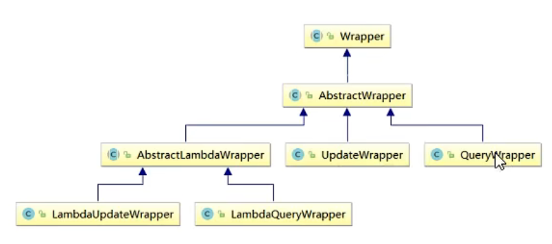

[TOC]

------


## MyBatis Plus

1. 依赖

```xml
<dependency>
    <groupId>com.baomidou</groupId>
    <artifactId>mybatis-plus-boot-starter</artifactId>
    <version>3.5.1</version>
</dependency>
```

2. 其他相关依赖
2. 在Mapper层继承BaseMapper

## 使用

1. 直接进行使用
2. 日志

```yml
mybatis-plus:
  configuration:
    log-impl: org.apache.ibatis.logging.stdout.StdOutImpl
```

3. 注意使用中id是由雪花算法生成，故id应该为bigint、Long
4. BaseMapper中的方法
   1. insert
   2. delete
      1. byid，通过id
      2. bymap，map即为条件
      3. batchids，通过集合删除
   3. update
      1. byid 通过实体类对象进行就该
   4. select
      1. byid 通过id修改
      2. bybatchids 通过集合进行查询
      3. bymap 通过map集合的条件进行查询
      4. list 通过条件构造器来查询（可以填null）
5. 自定义功能
   1. 映射文件路径设置 mybatis-plus:mapper-locations: 
   2. 其他与mybatis相同
6. Service CRUD接口
   1. 封装IService接口，进一步封装CRUD
      1. get查询单行
      2. remove删除
      3. list查询集合
      4. page分页
      5. 前缀命名方式区分Mapper层避免混淆
   2. 接口继承IService\<pojo>
   3. 实现类继承ServiceImpl<Mapper, pojo>实现上述接口
   4. 方法简介
      1. count 计数
      2. savebatch 批量添加 List
7. 注解
   1. 表与实体类的映射
      1. @TableName 在实体类加入这个设置实体类的映射表名
      2. mybatis-plus:global-config:db-config:table-prefix: 设置表前缀
   2. 属性和列的映射
      1. 默认主键名为id会使用雪花算法赋值
      2. @TableId，指定主键
         1. value 属性指定映射关系
         2. type 属性
            1. IdType.NONE 空
            2. IdType.ASSIGN_ID 雪花算法
            3. IdType.AUTO 自增，需要数据库设置自增
         3. mybatis-plus:global-config:db-config:id-type: 配置主键生成策略
      3. 雪花算法 由Twitter公布的分布式主键生成算法，它能保证不同表的主键不重复性，以及相同表的主键的有序性
         1. 核心思想 长度64bit
         2. 首先一个符号为1bit 由long基本类型在java中是带符号的，最高位是符号位，正数是0，负数是1，所以id一般为证书，最高位是0
         3. 41bit时间戳（毫秒级），存储时间戳的差值（当前时间戳开始时间戳），结果约等于69.73年
         4. 10bit作为机器的ID（5bit数据中心，5bit机器id，可以部署1024个节点）
         5. 12bit最为毫秒内的流水号（每个节点每秒产生4096个id）
         6. 优点 在整体上按照时间自增，且不碰撞
      4. @TableField 指定属性映射
         1. mybatis中包含默认配置将驼峰命名对应下划线命名
         2. value 指定映射关系
   3. 逻辑删除
      1. 指定一个int的默认值是0（未删除）的列
      2. @TableLogic 逻辑删除注解

## 条件构造器

1. wapper介绍
2. wapper
   1. QueryWrapper
      1. 常用语法
         1. like 模糊查询
         2. between 在什么区间
         3. isNotNull 不为空
         4. orderby 排序
            1. orderbyasc、orderbydesc
         5. gt 大于
         6. ge 大于等于
         7. lt 小于
         8. le 小于等于
         9. in 在其中
         10. eq 等于
         11. ne 不等于
         12. or 或
      2. 条件的优先级
         1. and(i->i.方法) 和or也可以用lambda方式
         2. lambda中的条件优先执行
      3. 组装select语句
         1. selectByMap中的条件输入select 中加入查询出指定字段
      4. 组装子查询
         1. *Sql 列、sql语句
   2. UpdateWrapper
      1. set 设置键值对
      2. entity可以填null
   3. 组装条件中为空情况
      1. StringUtils.isNotBlank(username)（Mybatis中的）判断某个字符串是否不为空、null、空白符
      2. condition条件是一个布尔类型的值，可以用来判断并组装该条件
   4. LambdaQueryWrapper、LambdaUpdateWrapper 第二个参数可以使用函数式编程指定列属性