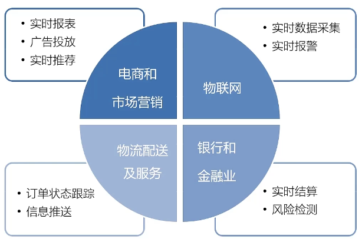

[TOC]

------

## Flink introduction

1. features

   1. Low latency
   2. High throughput
   3. Accuracy of results and good fault tolerance

2. Flink Stream processing

   1. Apache Flink is a framework and distributed processing engine for stateful computations over unbonded and bouded data streams

   2. Application scenarios of Flink

      

   3. Traditional data processing structures

      1. On-Line Transaction Processing(OLTP)
      2. On-Line Analysis processing(OLAP)

   4. layered

      1. SQL  |  Top-level language	
      2. Table API  |  Declarative domain-specific language
      3. DataDtream / DataSet API  |  Core API
      4. Stateful flow processing  |  The underlying API

## Flink Quick learning

1. dependencies

   ```xml
           <flink.version>1.13.0</flink.version>
           <dependency>
               <groupId>org.apache.flink</groupId>
               <artifactId>flink-java</artifactId>
               <version>${flink.version}</version>
           </dependency>
           <dependency>
               <groupId>org.apache.flink</groupId>
               <artifactId>flink-streaming-java_${scale.binary.version}</artifactId>
               <version>${flink.version}</version>
           </dependency>
           <dependency>
               <groupId>org.apache.flink</groupId>
               <artifactId>flink-clients_${scale.binary.version}</artifactId>
               <version>${flink.version}</version>
           </dependency>
   ```

2. batch processing

   ```java
   		// 1. 创建执行环境
           ExecutionEnvironment executionEnvironment = ExecutionEnvironment.getExecutionEnvironment();
           // 2. 从文件中读取数据
           DataSource<String> lineStringDataSource = executionEnvironment.readTextFile("learnFlink1/src/main/resources/input/words.txt");
           // 3. 将每行数据进行分词，转换成二元组类型
           FlatMapOperator<String, Tuple2<String, Long>> wordAndOneTuple = lineStringDataSource.flatMap((String line, Collector<Tuple2<String, Long>> out) -> {
               // 将一行文本进行分词
               String[] words = line.split(" ");
               // 将每个单词转换成二元组输出
               for (String word : words) {
                   out.collect(Tuple2.of(word, 1L));
               }
           }).returns(Types.TUPLE(Types.STRING, Types.LONG));
           // 4. 按照word进行分组
           UnsortedGrouping<Tuple2<String, Long>> wordAndOneGroup = wordAndOneTuple.groupBy(0);
           // 5. 分组内进行聚合统计
           AggregateOperator<Tuple2<String, Long>> sum = wordAndOneGroup.sum(1);
           // 6. 结果的打印输出
           try {
               sum.print();
           } catch (Exception e) {
               e.printStackTrace();
           }
   ```

3. Stream processing

   ```java
   		// 1. 创建流式执行环境
           StreamExecutionEnvironment executionEnvironment = StreamExecutionEnvironment.getExecutionEnvironment();
           // 2. 读取文件
           DataStreamSource<String> stringDataStreamSource = executionEnvironment.readTextFile("learnFlink1/src/main/resources/input/words.txt");
           // 3. 转换条件
           SingleOutputStreamOperator<Tuple2<String, Long>> wordAndOneTuple = stringDataStreamSource.flatMap((String line, Collector<Tuple2<String, Long>> out) -> {
               String[] words = line.split(" ");
               for (String word : words) {
                   out.collect(Tuple2.of(word, 1L));
               }
           }).returns(Types.TUPLE(Types.STRING, Types.LONG));
           // 4. 分组
           KeyedStream<Tuple2<String, Long>, String> wordAndOneKeyedStream = wordAndOneTuple.keyBy(data -> data.f0);
           // 5. 求和
           SingleOutputStreamOperator<Tuple2<String, Long>> sum = wordAndOneKeyedStream.sum(1);
           // 6. 打印
           sum.print();
           // 7. 启动执行
           try {
               executionEnvironment.execute();
           } catch (Exception e) {
               e.printStackTrace();
           }
   ```

   1. By default, multi-core CPU concurrent processing is used for stream processing
   2. Words of the same type are executed by the same thread

## 