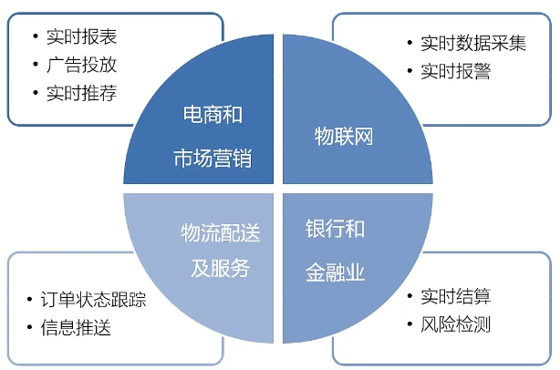

[TOC]

------

## Flink introduction

1. features

   1. Low latency
   2. High throughput
   3. Accuracy of results and good fault tolerance

2. Flink Stream processing

   1. Apache Flink is a framework and distributed processing engine for stateful computations over unbonded and bouded data streams

   2. Application scenarios of Flink

      

   3. Traditional data processing structures

      1. On-Line Transaction Processing(OLTP)
      2. On-Line Analysis processing(OLAP)

   4. layered

      1. SQL  |  Top-level language	
      2. Table API  |  Declarative domain-specific language
      3. DataDtream / DataSet API  |  Core API
      4. Stateful flow processing  |  The underlying API

## Flink Quick learning

1. dependencies

   ```xml
           <flink.version>1.13.0</flink.version>
           <dependency>
               <groupId>org.apache.flink</groupId>
               <artifactId>flink-java</artifactId>
               <version>${flink.version}</version>
           </dependency>
           <dependency>
               <groupId>org.apache.flink</groupId>
               <artifactId>flink-streaming-java_${scale.binary.version}</artifactId>
               <version>${flink.version}</version>
           </dependency>
           <dependency>
               <groupId>org.apache.flink</groupId>
               <artifactId>flink-clients_${scale.binary.version}</artifactId>
               <version>${flink.version}</version>
           </dependency>
   ```

2. batch processing

   ```java
   		// 1. 创建执行环境
           ExecutionEnvironment executionEnvironment = ExecutionEnvironment.getExecutionEnvironment();
           // 2. 从文件中读取数据
           DataSource<String> lineStringDataSource = executionEnvironment.readTextFile("learnFlink1/src/main/resources/input/words.txt");
           // 3. 将每行数据进行分词，转换成二元组类型
           FlatMapOperator<String, Tuple2<String, Long>> wordAndOneTuple = lineStringDataSource.flatMap((String line, Collector<Tuple2<String, Long>> out) -> {
               // 将一行文本进行分词
               String[] words = line.split(" ");
               // 将每个单词转换成二元组输出
               for (String word : words) {
                   out.collect(Tuple2.of(word, 1L));
               }
           }).returns(Types.TUPLE(Types.STRING, Types.LONG));
           // 4. 按照word进行分组
           UnsortedGrouping<Tuple2<String, Long>> wordAndOneGroup = wordAndOneTuple.groupBy(0);
           // 5. 分组内进行聚合统计
           AggregateOperator<Tuple2<String, Long>> sum = wordAndOneGroup.sum(1);
           // 6. 结果的打印输出
           try {
               sum.print();
           } catch (Exception e) {
               e.printStackTrace();
           }
   ```

3. Stream processing

   ```java
   		// 1. 创建流式执行环境
           StreamExecutionEnvironment executionEnvironment = StreamExecutionEnvironment.getExecutionEnvironment();
           // 2. 读取文件
           DataStreamSource<String> stringDataStreamSource = executionEnvironment.readTextFile("learnFlink1/src/main/resources/input/words.txt");
           // 3. 转换条件
           SingleOutputStreamOperator<Tuple2<String, Long>> wordAndOneTuple = stringDataStreamSource.flatMap((String line, Collector<Tuple2<String, Long>> out) -> {
               String[] words = line.split(" ");
               for (String word : words) {
                   out.collect(Tuple2.of(word, 1L));
               }
           }).returns(Types.TUPLE(Types.STRING, Types.LONG));
           // 4. 分组
           KeyedStream<Tuple2<String, Long>, String> wordAndOneKeyedStream = wordAndOneTuple.keyBy(data -> data.f0);
           // 5. 求和
           SingleOutputStreamOperator<Tuple2<String, Long>> sum = wordAndOneKeyedStream.sum(1);
           // 6. 打印
           sum.print();
           // 7. 启动执行
           try {
               executionEnvironment.execute();
           } catch (Exception e) {
               e.printStackTrace();
           }
   ```

   1. By default, multi-core CPU concurrent processing is used for stream processing
   2. Words of the same type are executed by the same thread
   
4. unbounded stream proccessing

   ```java
   public class StreamWordCount {
       public static void main(String[] args) {
           // 1. 创建流式执行环境
           StreamExecutionEnvironment executionEnvironment = StreamExecutionEnvironment.getExecutionEnvironment();
           // 2. 读取文本流
           // 从参数中提取主机名和端口号
           ParameterTool parameterTool=ParameterTool.fromArgs(args);
           String host = parameterTool.get("host");
           int port = parameterTool.getInt("port");
           DataStreamSource<String> lineDataStream = executionEnvironment.socketTextStream(host, port);
           // 3. 转换计算
           SingleOutputStreamOperator<Tuple2<String, Long>> wordAndOneTuple = lineDataStream.flatMap((String line, Collector<Tuple2<String, Long>> out) -> {
               String[] s = line.split(" ");
               for (String word : s) {
                   out.collect(Tuple2.of(word, 1L));
               }
           }).returns(Types.TUPLE(Types.STRING, Types.LONG));
           // 4. 分组
           KeyedStream<Tuple2<String, Long>, String> tuple2StringKeyedStream = wordAndOneTuple.keyBy(data -> data.f0);
           // 5. 求和
           SingleOutputStreamOperator<Tuple2<String, Long>> sum = tuple2StringKeyedStream.sum(1);
           // 6. 打印
           sum.print();
           try {
               executionEnvironment.execute();
           } catch (Exception e) {
               e.printStackTrace();
           }
       }
   }
   
   ```

## Flink deployment

1. Flink has serveral componets
   1. Client
   2. JobManager
   3. TaskManager
   4. Our code from Client to convert submit to JobManger. So JobManager is Manager of Flink cluster. And it is responsible for the central scheduling of jobs. It get the job from Client and further processes the data and distribute TaskManager to execute.
2. Flink default use port 8081 to start job
3. Several model
   1. Session model: Suitable for a single small scale, short execution time of a large number of jobs
   2. Single job model (Flink dose not support)
   3. Application model
   4. different: The life cycle of the cluster and the way resources are allocated, And where does the main method of the application actually execute(Client or JobManager)

## Flink System framework


1. JobManager
   1. JobManager control a application to execute main process, is core of Flink culster that is task management and dispatch.
   2. Jobmaster
      1. JobMaster is the most compose of core JobManager. And It to be responsible for dealing with single job.
      2. When a job is submitted, JobMaster connects to the application to be executed. Typically submitted by the client include: Jar packages, data flow graph, and job graph.
      3. JobMaster transforms JobGraph into a physical data flow diagram called "execution diagram", which contains all tasks that can be executed concurrently. JobMaster makes a request to the resource manager for the resources necessary to perform the task. Once it has enough resources, it will distribute the star paths to the TaskManager that actually runs them.
      4. During operation, JobMaster is responsible for all operations that require central coordination, such as the coordination of checkpoints
   3. ResourceManager
      1. Manager is mainly responsible for the allocation and management of resources, and there is only one in Flink cluster. Resources mainly refer to task slots of TaskManager.
      2. Task slots is a resource allocation unit in Flink cluster, which contains a set of CPU and memory resources used by the machine to perform calculations. Every Task needs to be assigned to a slot for execution.
   4. Dispatcher
      1. Dispatcher is mainly responsible for providing a REST interface to submit applications, and is responsible for starting a new JobMaster component for each newly submitted job. 
      2. Dispatcher will also launch a Web UI, which is used to conveniently display and monitor the information of job execution. Dispatcher is not necessary in the architecture, but may be in different deployment modes.
   
2. TaskManager
   1. A worker process in Flink.
   2. Usually there will be multiple TaskManagers running in Flink, and each task manager contains a certain number of slots. The number of slots limits the number of tasks that TaksManager can handle in parallel.
   3. After startup, TaskManager will register its slots with the resource manager, and after receiving the instructions from the resource manager, TaskManager will provide one or more slots for JobMaster to call. JobMaster can assign tasks to slots to execute.
   4. During execution, one TaskManager can exchange data with other task managers running unified applications.
   
3. Job submission process

   

