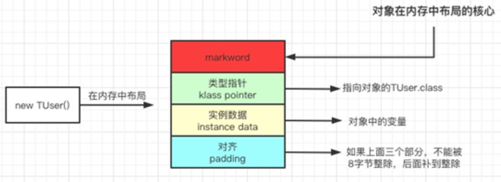

[TOC]

------

# Java并发编程

# 1. 前置知识

## 1.1 进程和线程

- 不同操作系统下进程和线程的含义可能略有不同，但大致如下

- 进程作为资源分配的单位
- 线程作为CPU调度的最小单位
- 一个进程可以有多个线程，进程间通信较为复杂，线程间通信更为简单
- 线程更轻量，不同线程间的上下文切换开销低于进程

## 1.2 并发和并行

- 并发（concurrent）一段时间能够应对多件事情的能力
- 并行（parallel）某一时刻能够同时去做多件事的能力

## 1.3 同步和异步

- 同步需要等待每条指令返回的结果到来后才能继续下条指令
- 异步不需要等待每条指令返回的结果到来就可以继续下条指令

## 1.4 I/O密集和CPU密集型应用

- 计算机需要为应用程序调度资源，其中I\O和CPU是应用程序所需的最重要的两个资源，其调度算法可参见操作系统相关书籍

- 现代操作系统几乎全部采用多处理器、分时操作系统（分时操作系统是使一台计算机采用时间片轮转的方式同时为几个、几十个甚至几百个用户服务的一种操作系统）

  ```java
  // 查看服务器核心数      
  System.out.println(Runtime.getRuntime().availableProcessors());
  ```

- I/O密集型应用期望能CPU使用率达到100%，则线程数设置

  - 理论上 核心数/（1-阻塞系数），阻塞系数=I/O等待时间/CPU占用时间+I/O等待时间，一般的I/O密集型应用阻塞系数在0.8~0.9之间
  - 经验上 核心数*2
  - 对我们的同步工具而言，就是I/O密集型应用，主要耗时在等待JDBC执行插入数据返回ACK时间
    - 所以理论上我们可以增大并发来进一步榨取CPU的能力

- CPU密集型通常设置线程数为 核心数+1

## 1.5 单体java应用实现并发的方法——多线程

- 通过Thread类创建线程，通过重写该类的run方法来执行我们编写的逻辑过程，通过Thread类的start方法启动线程

  ```java
  /* Make sure registerNatives is the first thing <clinit> does. */
      private static native void registerNatives();
      static {
          registerNatives();
      }
   /**
       * Initializes a Thread.
       *
       * @param g the Thread group
       * @param target the object whose run() method gets called
       * @param name the name of the new Thread
       * @param stackSize the desired stack size for the new thread, or
       *        zero to indicate that this parameter is to be ignored.
       * @param acc the AccessControlContext to inherit, or
       *            AccessController.getContext() if null
       * @param inheritThreadLocals if {@code true}, inherit initial values for
       *            inheritable thread-locals from the constructing thread
       */
      @SuppressWarnings("removal")
      private Thread(ThreadGroup g, Runnable target, String name,
                     long stackSize, AccessControlContext acc,
                     boolean inheritThreadLocals){...}
  
  /**
       * Causes this thread to begin execution; the Java Virtual Machine
       * calls the {@code run} method of this thread.
       * <p>
       * The result is that two threads are running concurrently: the
       * current thread (which returns from the call to the
       * {@code start} method) and the other thread (which executes its
       * {@code run} method).
       * <p>
       * It is never legal to start a thread more than once.
       * In particular, a thread may not be restarted once it has completed
       * execution.
       *
       * @throws     IllegalThreadStateException  if the thread was already started.
       * @see        #run()
       * @see        #stop()
       */
      public synchronized void start() {
          ...
              start0();
          ...
      }
  
  	private native void start0();
  ```


# 2. Java多线程实现

## 2.1 继承Thread类，重写run方法

```java
        new Thread() {
            @Override
            public void run() {
                log.info("{}", "hello world!");
            }
        }.start();
```

## 2.2 实现Runnable接口

```java
        new Thread(() -> log.info("{}", "hello world!")).start();
```

## 2.3 实现Callable接口

```java
        FutureTask<String> futureTask = new FutureTask<>(() -> "hello world!");
        new Thread(futureTask).start();
        log.info("{}", futureTask.get());
```

## 2.4 线程池

```java
    /**
     * Creates a new {@code ThreadPoolExecutor} with the given initial
     * parameters.
     *
     * @param corePoolSize the number of threads to keep in the pool, even
     *        if they are idle, unless {@code allowCoreThreadTimeOut} is set
     * @param maximumPoolSize the maximum number of threads to allow in the
     *        pool
     * @param keepAliveTime when the number of threads is greater than
     *        the core, this is the maximum time that excess idle threads
     *        will wait for new tasks before terminating.
     * @param unit the time unit for the {@code keepAliveTime} argument
     * @param workQueue the queue to use for holding tasks before they are
     *        executed.  This queue will hold only the {@code Runnable}
     *        tasks submitted by the {@code execute} method.
     * @param threadFactory the factory to use when the executor
     *        creates a new thread
     * @param handler the handler to use when execution is blocked
     *        because the thread bounds and queue capacities are reached
     * @throws IllegalArgumentException if one of the following holds:<br>
     *         {@code corePoolSize < 0}<br>
     *         {@code keepAliveTime < 0}<br>
     *         {@code maximumPoolSize <= 0}<br>
     *         {@code maximumPoolSize < corePoolSize}
     * @throws NullPointerException if {@code workQueue}
     *         or {@code threadFactory} or {@code handler} is null
     */
    public ThreadPoolExecutor(int corePoolSize,
                              int maximumPoolSize,
                              long keepAliveTime,
                              TimeUnit unit,
                              BlockingQueue<Runnable> workQueue,
                              ThreadFactory threadFactory,
                              RejectedExecutionHandler handler)
```

## 2.5 常用API

### 2.5.1 run方法

- 通过重写run方法实现该线程的逻辑

### 2.5.2 start方法

- 用于启动这个线程
- 注意这个线程一旦运行完成，不能再次使用，不能重复调用start

### 2.5.3 Thread.sleep方法

- 休眠该线程，让出CPU使用权，单位毫秒
- TimeUnit.MINUTES.sleep 通过指定枚举类休眠该线程
- 注意当休眠结束时线程不会立刻占有CPU而是进入就绪状态同其他线程一样等待被调度

### 2.5.4 LockSupport.park、unpark(thread)方法

- 阻塞该线程，让出CPU使用权、结束该线程的阻塞状态进入就绪队列

### 2.5.5 Thread.interrupted方法

- 打断当前线程或使用线程调用该方法打断线程，使打断标记置为true
- 若线程在休眠，或在阻塞，将抛出InterruptedException异常
- 若线程处于阻塞状态被打断恢复运行时，请讲打断标记恢复为false，调用isInterrupted方法，否则下次打断无效

### 2.5.6 Thread.currentThread方法

- 获取当前线程

### 2.5.7 getState方法

- 获取当前线程状态

  ```java
      public enum State {
          /**
           * Thread state for a thread which has not yet started.
           */
          NEW,
  
          /**
           * Thread state for a runnable thread.  A thread in the runnable
           * state is executing in the Java virtual machine but it may
           * be waiting for other resources from the operating system
           * such as processor.
           */
          RUNNABLE,
  
          /**
           * Thread state for a thread blocked waiting for a monitor lock.
           * A thread in the blocked state is waiting for a monitor lock
           * to enter a synchronized block/method or
           * reenter a synchronized block/method after calling
           * {@link Object#wait() Object.wait}.
           */
          BLOCKED,
  
          /**
           * Thread state for a waiting thread.
           * A thread is in the waiting state due to calling one of the
           * following methods:
           * <ul>
           *   <li>{@link Object#wait() Object.wait} with no timeout</li>
           *   <li>{@link #join() Thread.join} with no timeout</li>
           *   <li>{@link LockSupport#park() LockSupport.park}</li>
           * </ul>
           *
           * <p>A thread in the waiting state is waiting for another thread to
           * perform a particular action.
           *
           * For example, a thread that has called {@code Object.wait()}
           * on an object is waiting for another thread to call
           * {@code Object.notify()} or {@code Object.notifyAll()} on
           * that object. A thread that has called {@code Thread.join()}
           * is waiting for a specified thread to terminate.
           */
          WAITING,
  
          /**
           * Thread state for a waiting thread with a specified waiting time.
           * A thread is in the timed waiting state due to calling one of
           * the following methods with a specified positive waiting time:
           * <ul>
           *   <li>{@link #sleep Thread.sleep}</li>
           *   <li>{@link Object#wait(long) Object.wait} with timeout</li>
           *   <li>{@link #join(long) Thread.join} with timeout</li>
           *   <li>{@link LockSupport#parkNanos LockSupport.parkNanos}</li>
           *   <li>{@link LockSupport#parkUntil LockSupport.parkUntil}</li>
           * </ul>
           */
          TIMED_WAITING,
  
          /**
           * Thread state for a terminated thread.
           * The thread has completed execution.
           */
          TERMINATED;
      }
  ```

### 2.5.8 join方法

- 主线程必须等待子线程执行完毕后在执行，原理是调用wait方法

### 2.5.9 setDaemon方法

- 设置该线程为守护线程

# 3. JVM级别锁，synchronized关键字及优化原理

## 3.1 当该关键字作用于非静态方法，锁为该类的实例this

## 3.2 当该关键字作用于静态方法，锁为该类 xxx.class

## 3.3 同步代码块

- 被该关键字包裹的代码称为同步代码块，即同一时间只能由一个线程占有该代码块执行
- 其他未能争抢到锁的线程将进入阻塞队列，让出CPU使用权，直至一个线程执行完synchronized方法或调用锁的notify()方法或notifyAll()方法唤醒其他线程

## 3.4 底层原理

### 3.4.1 对象锁




```groovy
implementation 'org.openjdk.jol:jol-core:0.16'
```

```java
        System.out.println(ClassLayout.parseInstance(Main.class).toPrintable());
```


- markword 中一般包含三类信息，GC年龄、锁标识和对象 hashCode

```java
        System.out.println(ClassLayout.parseInstance(LOCK).toPrintable());
        synchronized (LOCK) {
            System.out.println(ClassLayout.parseInstance(LOCK).toPrintable());
        }
```


- 每个对象都是一个监视器锁(monitor)。当monitor被占用时就会处于锁定状态，线程执行 monitorenter指令时尝试获取monitor的所有权
  - 原子性：确保线程互斥的访问同步代码
  - 可见性：保证共享变量的修改能够及时可见
  - 有序性：有效解决重排序问题


### 3.4.2 偏向锁（java6引入，7后默认开启 -XX:-UseBiasedLocking = false可以关闭）

- 锁升级


- 加锁和解锁不需要额外消耗，和执行非同步方法相比仅存在纳秒级的差距
- 如果线程间存在锁竞争会带来额外的锁撤销消耗
- jvm会默认设置为偏向锁，当发生了多次锁竞争时，与初始的jvm认为的偏向线程有误（默认20次），jvm会认为自己判断错误会给另一个线程进行偏向，当执行一段时间后jvm发现该代码块仍然是多个线程竞争（40次），jvm会取消偏向锁，升级为轻量级锁
- 适用于只有一个线程访问同步代码块场景
- 调用锁的hashcode方法会撤销偏向状态，原因是hashcode和偏向锁共用了一块对象头内容
- 调用wait、notify方法会升级为重量级锁

### 3.4.3 轻量级锁（6引进）

- 当线程不能获得锁时线程不会立刻放弃CPU，会进入自旋状态，即乐观的期望锁马上被释放
- 这样做可以减少重量级锁切换花费的开销
- 适用于大量线程执行，但每个线程执行时间很短
- 注意轻量级锁只对多核CPU情况下才能得到优化
- 调用wait、notify方法会升级为重量级锁

### 3.4.4 重量级锁（-XX:+UseHeavyMonitors，使用重量级锁会撤销偏向锁和轻量级锁）

- 线程不适用自旋，不消耗CPU，线程阻塞，响应时间慢
- 适应于追求吞吐量，同步执行速度较长

### 3.4.5 锁重入

- 是指在已经加锁的代码块中继续用该锁加锁

- synchronized 是可冲入锁

  ```java
          System.out.println(ClassLayout.parseInstance(LOCK).toPrintable());
          synchronized (LOCK) {
              System.out.println(ClassLayout.parseInstance(LOCK).toPrintable());
              synchronized (LOCK) {
                  System.out.println(ClassLayout.parseInstance(LOCK).toPrintable());
              }
          }
  ```

  

- 不会重新绑定一个锁，会为monitor的计数器+1

### 3.4.6 锁消除

- 指虚拟机即时编译器在运行时，对一些代码要求同步，但是对被检测到不可能存在共享数据竞争的锁进行消除

### 3.4.7 锁粗化

- 原则上我们编写代码时要保证加锁的内容尽量的小
- 但如果对一系列连续操作反复加锁，或加锁出现在循环体内，不同的虚拟机实现可能会将加锁的范围扩大到整个操作，因为虚拟机认为，频繁加锁的代价更大

### 3.4.8 锁膨胀

- 不同与锁粗化，锁膨胀指的是锁升级的过程，注意，锁只会升级，不会降级

## 3.5 锁


任何一个对象都可以作为锁

### 3.6 volatile关键字

- 修饰成员变量

  - 保证其全局可见性
  - 保证不会出现指令重排序

- 原理，为其他变量读该值时增加读屏障，保证寄存器中的值必须会写内存后才能读

- 注意，读可见仅仅能保证读该操作时变量的值为当前值，如果要修改该变量的值，必须加锁保证原子性

  ```java
      private static volatile int x = 0;
      public static void main(String[] args) {
          Thread thread = new Thread(() -> {
              while (true)
                  x++;
          });
          new Thread(() -> {
              while (true)
                  if (x > 1) {
                      thread.stop();
                      log.info("{}",x);
                      break;
                  }
          }).start();
          thread.start();
      }
  ```

  

## 3.7 wait notify方法

- 这两个方法必须在持有锁的线程执行，否则将报错

- 这两个方法可以进行线程间的通信

  - 原理是在一个同步代码块中执行wait方法将阻塞该线程并立即释放锁所有权，在一个同步代码块中执行notify方法将随机唤醒一个线程进入阻塞队列，notifyAll方法将唤醒所有线程竞争锁
  - 一般我们可以采用notifyAll方法唤醒其他线程
  - 两阶段唤醒：使用while(!条件) lock.wait() 如果遇到条件成立则唤醒自己的线程执行下面的代码，保证线程即不会轮询空转消耗CPU，又可以及时得到相应

  ```java
      public static void main(String[] args) throws InterruptedException {
          AtomicInteger x = new AtomicInteger(1);
          ExecutorService executorService = Executors.newFixedThreadPool(3);
          executorService.execute(()->{
              synchronized (Main.class) {
                  while (true) {
                      while (x.get() != 1){
                          try {
                              Main.class.wait();
                          } catch (InterruptedException e) {
                              throw new RuntimeException(e);
                          }
                      }
                      log.info("1");
                      try {
                          Thread.sleep(1000);
                      } catch (InterruptedException e) {
                          throw new RuntimeException(e);
                      }
                      x.incrementAndGet();
                      Main.class.notifyAll();
                  }
              }
          });
          executorService.execute(()->{
              synchronized (Main.class) {
                  while (true) {
                      while (x.get() != 2){
                          try {
                              Main.class.wait();
                          } catch (InterruptedException e) {
                              throw new RuntimeException(e);
                          }
                      }
                      log.info("2");
                      try {
                          Thread.sleep(1000);
                      } catch (InterruptedException e) {
                          throw new RuntimeException(e);
                      }
                      x.incrementAndGet();
                      Main.class.notifyAll();
                  }
              }
          });
          executorService.execute(()->{
              synchronized (Main.class) {
                  while (true) {
                      while (x.get() != 3){
                          try {
                              Main.class.wait();
                          } catch (InterruptedException e) {
                              throw new RuntimeException(e);
                          }
                      }
                      log.info("3");
                      try {
                          Thread.sleep(1000);
                      } catch (InterruptedException e) {
                          throw new RuntimeException(e);
                      }
                      x.set(1);
                      Main.class.notifyAll();
                  }
              }
          });
      }
  ```

- 参数中可以设置超时时间

# 4. JDK级别锁，Lock接口，及ReentrantLock实现类、StampedLock

## 4.1 LOCK接口


## 4.2 ReentrantLock

- 可重入锁，不公平锁（默认），公平会影响性能

- 底层利用了park方法

- 基于AQS即AbstractQueuedSynchronizer

  

- 同synchronized使用方法类似，但需要显式的解锁

  ```java
      ReentrantLock lock = new ReentrantLock();
      lock.lock();
      try {
        log.info("xxxxxxxx");
      } finally {
        lock.unlock();
      }
  ```

- 线程通信

  ```java
      ReentrantLock lock = new ReentrantLock();
      Condition condition1 = lock.newCondition();
      Condition condition2 = lock.newCondition();
      ExecutorService executorService = Executors.newFixedThreadPool(3);
      executorService.execute(()->{
        lock.lock();
        try {
          condition1.await();
          log.info("等待条件1允许后执行！");
        } catch (InterruptedException e) {
          e.printStackTrace();
        } finally {
          lock.unlock();
        }
      });
      executorService.execute(()->{
        lock.lock();
        try {
          condition2.await();
          log.info("等待条件2允许后执行！");
          condition1.signalAll();
        } catch (InterruptedException e) {
          e.printStackTrace();
        } finally {
          lock.unlock();
        }
      });
      executorService.execute(()->{
        lock.lock();
        try {
          log.info("先执行");
          condition2.signalAll();
        } finally {
          lock.unlock();
        }
      });
  ```

  

  - 比jvm级别通信更强大，不仅可以使用多个条件阻塞线程但是注意调用的方法是await、signal
  - 读、写锁ReadWriteLock接口 ReentrantReadWriteLock实现类
    - 读读之间不会互斥
    - 读写之间会互斥
    - 写写之间会互斥
    - 无法保证写优先，当读锁过多时候，写锁少，存在锁饥饿现象，使用时候需要控制读写比例，防止出现锁饥饿现象

## 4.3 StampedLock（JDK8）

- StampedLock是比ReentrantReadWriteLock更快的一种锁，支持乐观读、悲观读锁和写锁。和ReentrantReadWriteLock不同的是，StampedLock支持多个线程申请乐观读的同时，还允许一个线程申请写锁
- StampedLock的底层并不是基于AQS的
- 在读多写少的场景中性能会比ReentrantReadWriteLock要好

## 4.4 常用API

- getHoldCount() 当前线程持有该锁的次数，如果当前线程没有持有该锁，则为零
- getQueueLength() 返回等待获取此锁的线程数的估计值。该值只是一个估计值，因为在此方法遍历内部数据结构时，线程数可能动态变化。此方法设计用于监视系统状态，而不是用于同步控制
- getWaitQueueLength(Condition condition) 返回在与此锁相关的给定条件上等待的线程数的估计值。请注意，由于超时和中断可能在任何时候发生，所以这个估计值仅作为实际等待者数量的上限。此方法设计用于监视系统状态，而不是用于同步控制
- hasQueuedThread(Thread thread) 查询给定线程是否正在等待获取此锁。注意，因为取消可能在任何时候发生，所以真正的返回并不能保证这个线程将获得这个锁。该方法主要用于监视系统状态
- hasQueuedThreads() 查询是否有线程正在等待获取此锁。注意，由于取消可能在任何时候发生，所以真正的返回并不保证任何其他线程将获得此锁。该方法主要用于监视系统状态
- hasWaiters(Condition condition) 查询是否有线程正在等待与此锁相关的给定条件。注意，因为超时和中断可能在任何时候发生，真正的返回并不保证将来的信号将唤醒任何线程。该方法主要用于监视系统状态
- isFair() 是否为公平锁
- isHeldByCurrentThread() 当前线程是否持有该锁
- isLocked() 查询此锁是否被任何线程持有。此方法设计用于监视系统状态，而不是用于同步控制
- lockInterruptibly() 
  - 与lock不同，在处于锁竞争阶段失败时，可以被打断
  - 使用lock只有竞争到锁后才可以被打断
- tryLock() 尝试获取锁，返回是否获取成功
- tryLock(long timeout, TimeUnit unit) 尝试在一定时间内获取锁，返回是否获取成功

# 5. CAS操作及原子类

## 5.1 CAS

- compare and swap，比较交换，非阻塞原子性操作，通过原子性操作，保证两个操作在同一个动作下完成

- 减小因加锁产生的上下文开销

- java实现原理

  - 通过java Unsafe类（不推荐程序员使用，必须通过反射获取）实现，其调用native方法，由JVM实现，它将内存位置的内容与给定值进行比较，只有在相同的情况下，才将内存位置的内容修改为新的值

    ```java
    public class UnsafeUtil {
        static Unsafe unsafe;
        static {
            try {
                Field theUnsafe = Unsafe.class.getDeclaredField("theUnsafe");
                theUnsafe.setAccessible(true);
                unsafe = (Unsafe) theUnsafe.get(null);
            } catch (NoSuchFieldException | IllegalAccessException e) {
                throw new RuntimeException("获取 Unsafe 对象异常");
            }
        }
        static Unsafe getUnsafe() {
            return unsafe;
        }
    }
    ```

## 5.2 线程安全

- 当不同线程操作一个可变对象时，就会发生线程安全问题
- JDK提供的不可变类，不可变类是指，一旦一个类的对象被创建出来，在其整个生命周期中，他的成员变量就不能修改
  - String
  - 基本类型的包装类
  - BigInteger、BigDecimal
- 自定义不可变类
  - 使类的所有成员变量被final修饰，所有的方法用final修饰，代表该类的方法不可被重写
  - 使该类的修饰符为final，代表该类不可被继承
  - 类中没有修改成员变量的方法，但可以提供一个带参的构造函数来初始化这些成员变量
- 享元模式（轻量级模式）
  - 类似于线程池、连接池，构建一个对象池
  - 这样对象是能够复用的，String类型是典型的应用了享元模式
  - 包装类也是应用享元模式的一个案例，默认情况下：
    - jvm会为Byte,Short,Integer,Long默认创建-128~127的类，为Character创建0~127的类，当使用这些类时，其实是使用了该对象池中的类
    - ==判断内存地址，当使用==判断包装类一旦超出缓存范围，将返回false，所以对于包装类请使用equals方法判断是否相等
- 常用的StringBuilder、Hashmap、HashSet、ArrayList等均是线程不安全的类，即当两个线程同时操作该类将造成问题
  - 常见的例如有IndexOutOfBoundsException


## 5.3 原子类

### 5.3.1 介绍

- 原子类是一种包装类

- 原子类提供了一系列CAS的操作

- 常应用于多线程、函数式编程

  ```java
  @Slf4j
  public class Main {
      public static void main(String[] args) throws InterruptedException {
          AtomicInteger x = new AtomicInteger();
          test(() -> {
              x.set(5);
              return x.get();
          });
      }
      private static void test(hs hs){
          log.info("{}", hs.fun());
      }
  }
  @FunctionalInterface
  interface hs{
      int fun();
  }
  ```

  

### 5.3.2 基本原子类

- AtomicBoolean(原子Boolean类)

- AtomicInteger（原子整形类）

- AtomicLong（原子长整型类）

  ```java
          AtomicInteger x = new AtomicInteger(0);
          x.compareAndSet(0,1);
          x.getAndUpdate(operand -> operand == 1 ? 2 : 3);
          log.info("{}", x.get());
  ```

  

### 5.3.3 引用原子类

- （基础原子引用类）

- AtomicMarkableReference（可以判断共享变量是否修改过的原子引用类）

  - 其会维护一份标记，当引用被修改过后标记将会被修改

- AtomicStampedReference（带戳的原子引用类）

  - 其会维护一个版本号，当引用被修改后版本号会自增
  - 因为仅仅维护一份标记是不够的，当前在执行方法时不能判断一个类是否由A变为B又变为A，即ABA问题

  ```java
          Integer a = 0;
          AtomicStampedReference<Integer> x = new AtomicStampedReference<>(a, 0);
          x.set(5, 1);
          x.set(a, 2);
          int[] stamp = new int[1];
          Integer integer = x.get(stamp);
          log.info("{}", integer);
          log.info("{}", Arrays.toString(stamp));
  ```

  

### 5.3.4 原子数组类

- AtomicIntegerArray（整型原子数组类）
- AtomicLongArray（长整型原子数组类）
- AtomicReferenceArray（引用对象原子数组类）

### 5.3.5 字段更新器原子类（必须配合volatile修饰符修饰field使用）

- AtomicReferenceFieldUpdater
- AtomicIntegerFieldUpdater
- AtomicLongFieldUpdater

### 5.3.6 原子累加器

-  LongAdder

# 6. 线程间通信、死锁、饥饿

# 7. AQS及JDK线程池

# 8. Java并发工具包

# 9. 新特性JDK19协程

# 10. Flink异步编程

