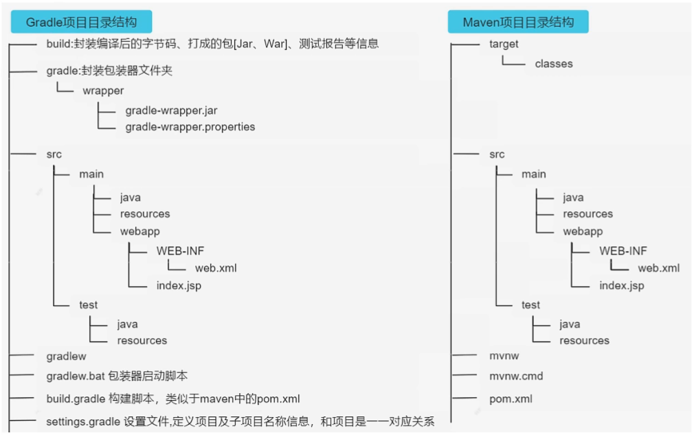
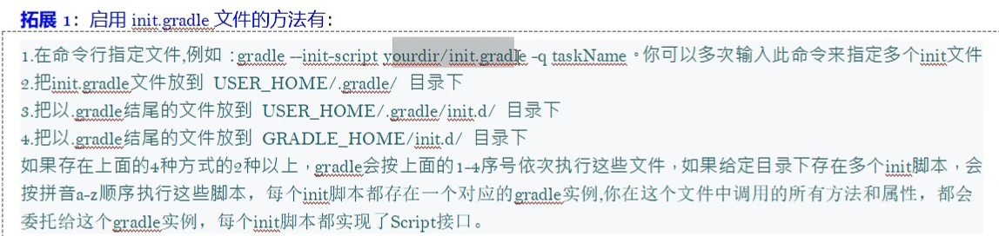
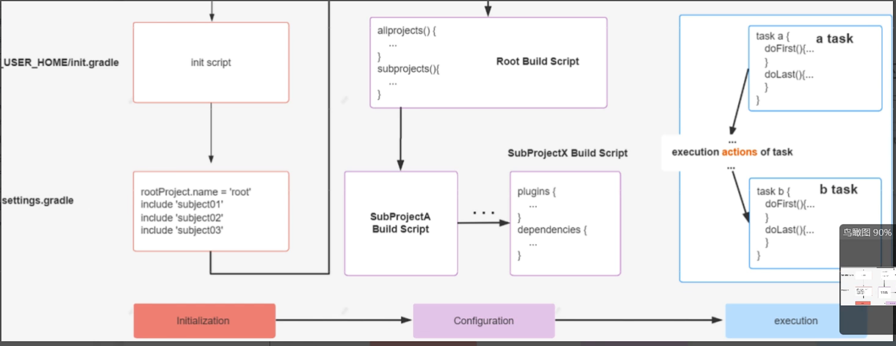

[TOC]

------


## 1. Gradle introduce

### 1.1 introduce

1.  Gradle supports generating JAR packages
1.  Gradle supports managing dependency
1.  Compared to Maven,XML files are abandoned and Groovy language is used in Gradle

### 1.2 PATH

- GRADLE_USER_HOME: Gradle repository
- GRADLE_HOME

### 1.3 The directory structure



### 1.4 Gradle source

#### 1.4.1 init.d directory

- Create file that is the suffix of .gradle to execute before project.

  

  - mavenLocal()
    - need environment variable M2_HOME
  - developer.aliyun.com/mvn/guide  some sources

  

  

### 1.5 Gradle wrapper

- Using gradle wrapper can avoid the impact of version configuration and other issues on the project 
  - gradlew
  - gradlew.cmd
- command
  - gradle wrapper --gradle-version Specify the version
  - gradle--gradle-distribution-url Specify the url

## 2. Idea use Gradle

1. File structure
   1. src/main/java Placing production code
   2. src/test/java Placing test code
   3. src/main/resouces Placing production configuration file
   4. src/test/resources Placing test configuration file
   5. src/main/webapp Placing page elements
2. Groovy console

## 3. Groovy syntax

### 3.1 The official website

[The Apache Groovy programming language (groovy-lang.org)](http://www.groovy-lang.org/)

### 3.2 syntax

1. First program

   ```groovy
   println("hello world!")
   ```

2. Groovy can omit the trailing ";"

3. Groovy can omit "()"

4. Groovy can use script or class in the same file.

   1. Do not use class name as file name.

   2. Specific data types are not recommended.

5. Default modifier is public.

6. Assign a value to an object

   1. Object.attribute = xxx
   2. Object.setter
   3. Named name constructor

7. 

8. Define variables

   1. "def" defines weakly typed variables

      ```groovy
      def i=18
      ```

   2. Define list

      ```groovy
      def list=['a','b']
      list << 'c'
      println list.get(2)
      ```

   3. Define map

      ```groovy
      def map=['key1':'value1','key2':'value2']
      map.key3='value3'
      println map.get('key3')
      ```

9. Closures in Groovy

   1. Simple Closure

      ```groovy
      def a = {
          println "This is the closures!"
      }
      def method(Closure closure){
          closure()
      }
      method(a)
      ```

   2. Closure with parameters

      ```groovy
      def b = {
          v -> println "hello ${v}"
      }
      def method2(Closure closure){
          closure("xiao ming")
      }
      method2(b)
      ```

### 3.3 plugins

#### 3.3.1 Junit

- junit5 need some code

  ```groovy
  test{
      enabled(false) //jump test
  	useJUnitPlatform()
      include('xxx') //execute specific package(use ** to refer to files)
      exclude('xxx')
  }
  ```

  

## 4. Life cycle

### 4.1 Initialization

- process

  

### 4.2 settings file

- The initialization phase determines which projects are introduced to be added to the project build
- use ':' segmentation

### 4.3 Task

#### 4.3.1 Behavior of task

- Task is a list of object
- Closure as last parameter could write out side.
  - Configuration Project
  - Execute Project
    - doFirst{}
      - Add first, execute later
    - doLast{}
      - Those added later will be executed later
- behavior
  - Can be defined internally or externally
- Can pass a map closure
- << 已废弃，代表dolast

#### 4.3.2 The way tasks are dependent

- parameter dependence 
  - use parameter "dependsOn: []"

- inner dependence 
  - dependsOn = []
- outer dependence 
  - dependsOn = []
- If the tasks do not depend on each other, the execution of the dependencies is random
